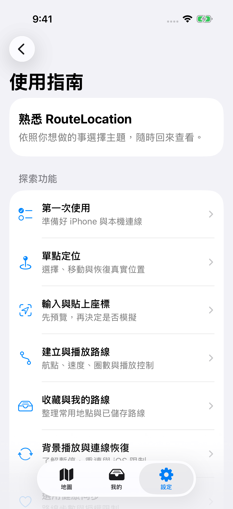
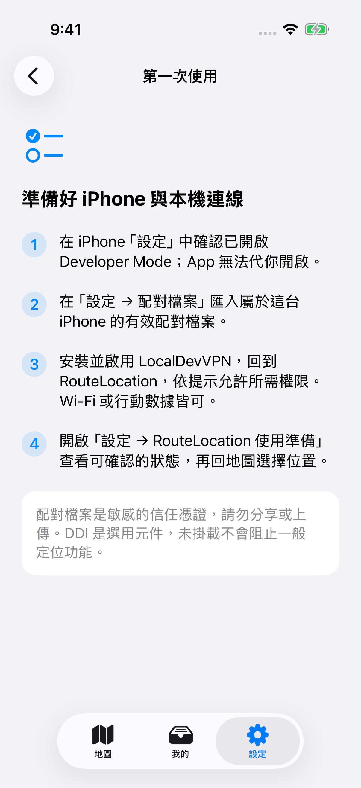

# RouteLocation

繁體中文 | [English](README.en.md)

RouteLocation 是一款 iPhone 本機定位模擬與路線播放工具。你可以選擇座標或地點、在裝置上建立路線，並以自訂速度播放。RouteLocation 是 StikDebug 的 location-only 衍生版本；不需要帳號、自訂後端或雲端同步。

## 安裝

在 SideStore 的來源管理中加入官方來源：

<https://raw.githubusercontent.com/peijungwu0302-Wu/StikDebug/main/source.json>

之後可由來源頁面安裝及更新 RouteLocation。也可以下載最新未簽名 IPA，再使用 SideStore、AltStore、TrollStore 或其他相容工具簽署：

<https://github.com/peijungwu0302-Wu/StikDebug/releases/latest/download/RouteLocation-unsigned.ipa>

GitHub Releases 是各版本變更紀錄的正式來源。

## 功能

- 以地圖、搜尋、收藏或精確座標選取單點位置。
- 以原生「貼上」快速帶入一個座標，或把多個座標整理成路線；貼上不會自動開始模擬或播放。
- 建立、預覽、儲存及播放多航點路線；支援直線與 Apple Maps 導航幾何。
- 調整播放速度、暫停／繼續、有限或無限圈數，並在定位連線恢復時保留路線進度。
- 在單點與路線播放間直接切換，不必先恢復真實位置。
- 管理收藏地點、最近位置及已儲存路線。
- 可選擇性顯示地圖 S2 網格；預設關閉，僅供地圖視覺參考，不參與定位或路線播放。
- 選擇繁體中文或英文、隨系統／淺色／深色外觀，以及只影響唯讀座標值的文字大小。

## 需求

- iPhone 與 iOS 17.4 或以上版本。
- 在 iPhone 設定中啟用 Developer Mode。
- 目前這台裝置有效的配對檔案。配對檔案是敏感的信任憑證，請勿分享、提交或上傳。
- 安裝並啟用 [LocalDevVPN](https://apps.apple.com/us/app/localdevvpn/id6755608044)，以提供 RouteLocation 到裝置服務的本機網路路徑。
- Wi-Fi 或行動數據皆可；Wi-Fi 並非產品必要條件。
- 透過 SideStore、AltStore、TrollStore 或其他相容工具安裝並簽署 IPA。

### DDI 是選用元件

Developer Disk Image（DDI）是 Apple 開發者服務元件。RouteLocation 會以 best-effort 方式檢查及準備 DDI；已掛載時不需重複處理，準備失敗會保留診斷狀態並繼續可用的定位流程。未掛載 DDI 不會阻止一般單點或路線定位模擬。你可在「設定 → 開發者工具」查看狀態或手動檢查／掛載。DDI 不會儲存或取得裝置的真實 GPS 位置。

## 第一次設定

1. 在 iPhone 設定中啟用 Developer Mode。
2. 由 SideStore 來源安裝 RouteLocation，或安裝並簽署未簽名 IPA。
3. 匯入屬於這台 iPhone 的有效配對檔案。
4. 啟用 LocalDevVPN，並允許 RouteLocation 使用所需的位置權限。
5. 回到地圖；在 Wi-Fi 或行動數據可用時選取位置並開始模擬。

正常定位流程不要求先掛載 DDI。若裝置通道尚未就緒，請依 App 顯示的設定或連線提示處理。配對、LocalDevVPN 與裝置服務錯誤和 DDI 狀態是分開的。

## 隨時查閱使用指南

忘記操作時，可隨時開啟「設定 → 使用指南」，選擇第一次使用、單點定位、輸入座標、路線、收藏、連線恢復或健康同步。指南不會啟動模擬或變更你的設定。

也可在使用指南開啟「互動教學中心」，選擇快速開始、常用功能或連線疑難排解。教學會標出真正的操作入口，依實際 App 狀態推進；模擬、開始路線與恢復真實位置仍由你操作。每一步都能結束教學，已完成的模擬或資料不會因此還原。

<p>
  
  
</p>

以上為 GitHub Actions 實際啟動 App 後擷取的 iPhone 模擬器畫面；不是示意圖，也不代表已完成實機連線驗證。[截圖來源與重現方式](docs/images/guide/README.md)。

### 驗證狀態（Validation Status）

Actions 的 UI 測試可驗證畫面導覽、教學入口與結束教學。單點與 Route Player 展示使用 DEBUG 模擬器限定的公開台北示範座標和注入狀態；不會傳送裝置定位指令，也不代表已驗證實機 GPS。LocalDevVPN、實際模擬／恢復、行動網路輔助與背景播放仍需要 physical iPhone 驗證。

## Wi-Fi 與行動數據

Wi-Fi 與行動數據都可用於裝置服務連線；LocalDevVPN 負責 RouteLocation 到同一台 iPhone 的本機通道，不會替其他 App 代理一般網際網路流量。若行動數據冷啟動需要輔助流程，請先在 RouteLocation 設定好 Data Off／Data On 捷徑，並依 App 畫面操作。輔助流程可能暫時關閉行動數據；不要將此步驟誤認為 DDI 必要條件。

Apple 地圖搜尋、未快取地圖圖磚、反向地理編碼與新的導航路線計算可能需要網際網路。直線幾何與已儲存的完整導航幾何可在本機使用。

## 單點與路線模擬

在地圖選取或輸入一個座標，再按「在此模擬」。目前已模擬單點時可直接改到另一座標，不需要先恢復真實位置。建立路線時可新增航點、選擇直線或導航幾何，調整速度及圈數，預覽後再開始播放。播放中可調整速度、暫停或繼續；連線中斷時 App 會依既有復原流程保留進度。

「恢復真實位置」會停止目前模擬並清除開發者位置覆寫，讓裝置回到真實 GPS。單點與路線間直接切換則保留模擬狀態，不會先切回真實 GPS。

## 收藏與「我的」

「我的」可管理收藏地點、最近位置及已儲存路線。收藏排序（包含手動順序）會同時用於地圖上的快速收藏選擇。資料儲存在本機；移除或重排收藏不會上傳資料。

## 外觀、語言與座標文字

在「設定 → 介面」可選擇繁體中文或英文、隨系統／淺色／深色外觀，以及較小、標準、較大或跟隨系統的座標文字大小。座標文字設定只作用於唯讀的精確座標顯示，不會改變地點名稱、路線、按鈕、一般文字或座標輸入欄位。

## 選用 Health Sync

Health Sync 可在路線播放時依時間或距離計算步數並嘗試寫入 Apple 健康。它是選用功能；步數寫入需要目前簽名具備可用的 HealthKit 能力及使用者授權。部分免費側載簽名不含所需 HealthKit entitlement，因此步數同步可能不可用。這不影響單點定位、路線播放或任何定位功能。單點傳送不會記錄步數。

## 背景播放限制

背景播放受 iOS 管理，屬於 best-effort。強制結束 App、iOS 終止程序、重新啟動裝置、LocalDevVPN 中斷或其他系統狀況都可能停止播放。RouteLocation 不會因為畫面切換或 App 進入背景就主動停止播放，也不能控制其他 App 的 VPN。

## 隱私

RouteLocation 將收藏與路線儲存在本機，沒有帳號、分析、遙測、自訂後端、CloudKit 或路線上傳。只有在你使用地圖顯示、搜尋、導航計算或地點／地址查詢時，才會連接 Apple 服務。配對檔案內容不會上傳。

## 從原始碼建置

實際 iOS 建置需要 macOS 與 Xcode：

```sh
xcodebuild -project StikDebug.xcodeproj -scheme StikDebug \
  -configuration Release -destination 'generic/platform=iOS' \
  CODE_SIGNING_ALLOWED=NO build
```

GitHub Actions 會在功能分支執行測試、封存及 IPA 打包；正式版本由已驗證的同一個 IPA artifact 進行 promotion，不會在正式 tag 重建。未簽名 IPA 不包含個人 Apple ID、簽署憑證或配對檔案。

## 測試界線

自動化測試涵蓋座標解析、路線幾何與播放、保存／載入、連線復原及其他應用程式邏輯。單元測試不能證明特定 iPhone、電信商、LocalDevVPN、配對檔案、RSD／DVT 或 iOS 背景行為；這些仍須在實機上驗證。請勿將 CI 或模擬器結果當作所有裝置上的保證。

## 致謝與授權

RouteLocation 是 Stephen Bove（Stik）及貢獻者所開發 **StikDebug** 的衍生版本，保留上游裝置通訊核心與授權。`idevice` 相關工作歸功於 jkcoxson 及其貢獻者；其他上游與套件致謝請見原始碼及授權文件。

本專案依 **GNU Affero General Public License v3.0（AGPL-3.0）** 發行，詳見 [LICENSE](LICENSE)。
